<div align="center">

# contribution-gallery

**A gallery of animations for your GitHub contribution graph — a Splatoon-style territory battle, plus six ambient scenes.**



*Inspired by [Splatoon](https://en.wikipedia.org/wiki/Splatoon) — two AI snakes race across your contribution graph, painting territory and stealing each other's ground.*

[](LICENSE)

</div>

---

## What is this?

A GitHub Action that generates an animated SVG of two snakes battling for territory on your GitHub contribution graph — like a Splatoon ink battle.

Unlike the classic [Platane/snk](https://github.com/Platane/snk) (single snake eating cells), this project features:

- **Two competing snakes** — starting from opposite corners of the grid
- **Territory painting** — each snake claims cells in Hot Pink or Cyan
- **Competitive AI** — 9 heuristic factors + stagnation-aware ε-greedy exploration
- **Score display** — live territory percentage bar
- **Dark mode support** — separate palettes for light/dark themes

## How it Works

Each snake evaluates moves using a **multi-factor scoring system** that balances local efficiency with global exploration:

| Factor | Weight | Purpose |
|--------|--------|---------|
| Distance-decayed BFS | variable | Prioritize nearby unpainted cells |
| Frontier bonus | +15 | Reward painting fresh ground |
| Global compass | +10 | Head toward unexplored regions |
| Opponent avoidance | +10/−8 | Separate snakes for coverage |
| Escape route check | −5/−20 | Avoid dead-ends |
| Long-range navigation | +30/−10 | March toward nearest target when stuck |
| Loop detection | force random | Break positional cycles |
| Stagnation ε-greedy | 0.5%→15% | Increasing randomness when stuck |

This achieves **100% grid coverage** with natural variation in territory split.

**[→ Full algorithm documentation](docs/ALGORITHM.md)**

## ✨ Ambient Mode

An alternative renderer: six quiet, cell-based animation scenes rotate every minute on one seamless loop — no reset, no pause.


| Scene | Description |
|-------|-------------|
| 🌌 Aurora | A teal→blue→violet color field drifts across the whole graph |
| 💧 Ripple | Waves radiate from your most active cells |
| 💓 Pulse | The graph breathes; amplitude follows contribution level |
| 🌧️ Rain | Light drops fall down each column at its own pace |
| ✨ Fireflies | Cells glow in and out like fireflies over the graph |
| 🦠 Life | Conway's Game of Life seeded from your actual contributions |

Every cell takes part — zero-contribution days shimmer, pulse and glow at a softer intensity, so the whole canvas stays alive. The scene order is fully shuffled on every render, and so are the random details — ripple origins, rain speeds, firefly picks. Five scenes are compact CSS keyframe loops (each cell only carries a phase offset), so the whole file stays around ~200 KB, roughly a third of the splatoon animation.

Enable it with `?mode=ambient` in the action outputs:

```yaml
outputs: |
  dist/ambient.svg?mode=ambient
  dist/ambient-dark.svg?palette=dark&mode=ambient
```

Or via CLI: `npx tsx src/cli.ts --user <name> --mode ambient [--dark]`

### 🔀 Per-refresh shuffle (serverless endpoint)

A committed SVG is static, so its scene order only changes when it is regenerated. For a freshly shuffled order on **every page load**, deploy the included Vercel function and point your README at it:

[](https://vercel.com/new/clone?repository-url=https%3A%2F%2Fgithub.com%2Fcrosscore%2Fcontribution-gallery)

- `GET /api/ambient` — light theme
- `GET /api/ambient?theme=dark` — dark theme

The endpoint renders the SVG with a random seed per request and sends `Cache-Control: no-store`, so GitHub's camo proxy re-fetches it on every view. Contribution data comes from [docs/grid.json](docs/grid.json), regenerated daily by CI — no GitHub token is needed at request time (override the data source with the `GRID_URL` env var).

```html
<picture>
  <source media="(prefers-color-scheme: dark)" srcset="https://<your-project>.vercel.app/api/ambient?theme=dark" />
  <source media="(prefers-color-scheme: light)" srcset="https://<your-project>.vercel.app/api/ambient" />
  .vercel.app/api/ambient?theme=dark" />
</picture>
```

## Quick Start

```yaml
# .github/workflows/splatoon.yml
name: Generate Splatoon Animation

on:
  schedule:
    - cron: "0 0 * * *"
  workflow_dispatch:

permissions:
  contents: write

jobs:
  generate:
    runs-on: ubuntu-latest
    steps:
      - uses: crosscore/contribution-gallery@v1
        with:
          github_user_name: ${{ github.repository_owner }}
          outputs: |
            dist/splatoon.svg
            dist/splatoon-dark.svg?palette=dark

      - uses: crazy-max/ghaction-github-pages@v4
        with:
          target_branch: output
          build_dir: dist
        env:
          GITHUB_TOKEN: ${{ secrets.GITHUB_TOKEN }}
```

Then add to your profile README:

```html
<picture>
  <source media="(prefers-color-scheme: dark)" srcset="https://raw.githubusercontent.com/<user>/<user>/output/splatoon-dark.svg" />
  <source media="(prefers-color-scheme: light)" srcset="https://raw.githubusercontent.com/<user>/<user>/output/splatoon.svg" />
  /<user>/output/splatoon-dark.svg" />
</picture>
```

## Customization

| Option | Default | Description |
|--------|---------|-------------|
| `color_snake_1` | `#E8006A` | Hot Pink — Snake 1 body |
| `color_snake_2` | `#008CC8` | Cyan — Snake 2 body |
| `color_trail_1` | `#FF85AA` | Light Pink — Snake 1 trail |
| `color_trail_2` | `#5DD4FF` | Light Cyan — Snake 2 trail |
| `speed` | `1` | Animation speed multiplier |
| `strategy` | `aggressive` | AI strategy: `aggressive`, `balanced`, `random` |

## Architecture

```
src/
├── fetcher/          # GitHub contribution graph API
├── solver/           # Snake AI — multi-factor heuristic scoring
│   └── index.ts      # chooseDirection(), BFS, loop detection
├── renderer/         # SVG animation generator
│   ├── grid.ts       # Contribution grid rendering
│   ├── animation.ts  # Keyframe animation engine (splatoon battle)
│   └── ambient.ts    # Ambient mode — six scenes rotating per minute
├── game/             # Game loop & territory logic
│   ├── engine.ts     # Turn-based simulation + stagnation tracking
│   ├── snake.ts      # Snake state & movement
│   └── territory.ts  # Score calculation
└── cli.ts            # Local dev entry point
api/
└── ambient.ts        # Vercel function — per-request random ambient SVG
```

## Development

```bash
npm install
npm run dev        # Local dev server with live preview
npm run build      # Build the GitHub Action
npm run test       # Run tests
```

## License

MIT

