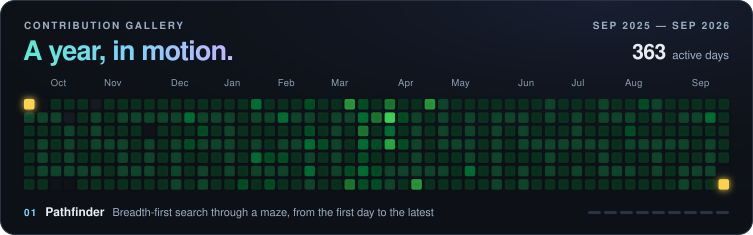

<div align="center">

# contribution-gallery

**A living canvas for your GitHub profile.**

<picture>
  <source media="(prefers-color-scheme: dark)" srcset="docs/ambient-dark.svg" />
  <source media="(prefers-color-scheme: light)" srcset="docs/ambient.svg" />
  
</picture>

Nine ambient scenes. Colorful pixel cards. Your work, in motion.

[](LICENSE)

</div>

## Ambient gallery

Nine scenes play across your contribution graph, one every 15 seconds on a single seamless 135-second loop — no reset, no pause. Some are ambient loops; others are little stories that play out from start to finish inside their window.

| Scene | Description |
|-------|-------------|
| 🌈 Plasma | Demoscene palette cycling — bands of color roll along a sum-of-sines field |
| ✨ Constellation | Your busiest days become stars, joined one by one into a star chart |
| 🌊 Tide | One long swell rolls across the year, deep teal at the floor and pale foam at each crest |
| 🟩 Code Rain | Green glyph streams fall down every week, each at its own pace |
| 🧭 Pathfinder | A breadth-first search floods a maze from the first day to the latest, then traces the route |
| 🦠 Life | Conway's Game of Life, seeded by the days you showed up |
| 📊 Sort | Weeks ranked by activity become bars, sorted in parallel passes into a staircase |
| 🏓 Pong | The year plays itself at Pong — spin off the paddles, a pixel scoreboard, the odd missed return |
| 💓 Heartbeat | A steady pulse traced week by week, like a bedside monitor |

Every scene draws from one spectrum — mint, sky, indigo, violet, pink and a single warm amber — tuned separately for light and dark cards, and a blurred copy of the scene layer gives every lit cell a soft bloom at no extra file size. The real graph always stays underneath: each scene dims it with its own veil rather than replacing it, so your year remains readable through every animation. The header shows the date range and your active days, the graph reveals itself column by column on load, scenes crossfade with eased envelopes, and a gallery placard plus a segmented progress bar name the scene that is playing.

Story scenes (Pathfinder, Sort, Pong, Constellation, Life) are scripted in SMIL on the shared cycle and rest at their first frame outside their window, so every crossfade starts cleanly. Continuous scenes are compact CSS keyframe loops where each cell only carries a phase offset. The scene order is shuffled on every render, and so are the details — the maze, the rally, the star picks, the plasma field — while the file stays around 260–290 KB.

Enable it with `?mode=ambient` in the action outputs:

```yaml
outputs: |
  dist/ambient.svg?mode=ambient
  dist/ambient-dark.svg?palette=dark&mode=ambient
```

Or via CLI: `npx tsx src/cli.ts --user <name> --mode ambient [--dark]`

### 🔀 Per-refresh shuffle (serverless endpoint)

A committed SVG is static, so its scene order only changes when it is regenerated. For a freshly shuffled order on **every page load**, deploy the included Vercel function and point your README at it:

[](https://vercel.com/new/clone?repository-url=https%3A%2F%2Fgithub.com%2Fcrosscore%2Fcontribution-gallery)

- `GET /api/ambient` — light theme
- `GET /api/ambient?theme=dark` — dark theme

The endpoint renders the SVG with a random seed per request and sends `Cache-Control: no-store`, so GitHub's camo proxy re-fetches it on every view. Contribution data comes from [docs/grid.json](docs/grid.json), regenerated daily by CI — no GitHub token is needed at request time (override the data source with the `GRID_URL` env var).

```html
<picture>
  <source media="(prefers-color-scheme: dark)" srcset="https://<your-project>.vercel.app/api/ambient?theme=dark" />
  <source media="(prefers-color-scheme: light)" srcset="https://<your-project>.vercel.app/api/ambient" />
  .vercel.app/api/ambient?theme=dark" />
</picture>
```

### 📊 Profile cards (stats, langs, streak, trophy)

Four endpoints share a dark-first visual system: fine borders, consistent spacing, clear typography, and colorful animated pixels.

| Endpoint | Card |
|----------|------|
| `/api/stats` | A prominent commit total and four supporting metrics with shimmering pixel icons |
| `/api/langs` | Language-colored cell bars with a traveling shimmer and exact byte-share percentages |
| `/api/streak` | All-time contributions, current and longest streaks, and a glowing pixel flame |
| `/api/trophy` | Seven ranked pixel trophies with glints and S-tier sparkles |

Use `?theme=dark` for the dark palette; the default API palette remains light for existing embeds. The ambient, streak, and trophy cards are 753px wide. The stats and languages cards are 375 × 256px; embed each at `width="369"` to fit them side by side with a small gap, and let them wrap on narrow screens. All images have self-contained SVG/CSS animations, accessible descriptions, and reduced-motion fallbacks. The nine ambient scenes play in a freshly shuffled order on every render.

Numbers come from [docs/stats.json](docs/stats.json), refreshed by CI every six hours. Language percentages describe the indexed language bytes in that snapshot; bars are linear relative to the largest language. No GitHub token is needed at request time.

Profile numbers and language percentages use **Inter** by default. Choose `font=outfit` for rounder numerals, `font=space` for Space Grotesk, or `font=mono` for the original style; for example, `/api/stats?theme=dark&font=inter`. The three bundled typefaces embed only their numeric glyphs, so they render consistently without external font requests. Switch between all four styles in `npm run preview`. Font sources and licenses are in [src/renderer/fonts](src/renderer/fonts).

## Quick Start

```yaml
# .github/workflows/contribution-gallery.yml
name: Generate Contribution Gallery

on:
  schedule:
    - cron: "0 0 * * *"
  workflow_dispatch:

permissions:
  contents: write

jobs:
  generate:
    runs-on: ubuntu-latest
    steps:
      - uses: crosscore/contribution-gallery@v1
        with:
          github_user_name: ${{ github.repository_owner }}
          outputs: |
            dist/ambient.svg?mode=ambient
            dist/ambient-dark.svg?palette=dark&mode=ambient

      - uses: crazy-max/ghaction-github-pages@v4
        with:
          target_branch: output
          build_dir: dist
        env:
          GITHUB_TOKEN: ${{ secrets.GITHUB_TOKEN }}
```

Then add to your profile README:

```html
<picture>
  <source media="(prefers-color-scheme: dark)" srcset="https://raw.githubusercontent.com/<user>/<user>/output/ambient-dark.svg" />
  <source media="(prefers-color-scheme: light)" srcset="https://raw.githubusercontent.com/<user>/<user>/output/ambient.svg" />
  /<user>/output/ambient-dark.svg" />
</picture>
```

<details>
<summary>Optional territory battle and customization</summary>

### Territory battle

A GitHub Action that generates an animated SVG of two snakes battling for territory on your GitHub contribution graph — like a Splatoon ink battle.

Unlike the classic [Platane/snk](https://github.com/Platane/snk) (single snake eating cells), this project features:

- **Two competing snakes** — starting from opposite corners of the grid
- **Territory painting** — each snake claims cells in Hot Pink or Cyan
- **Competitive AI** — 9 heuristic factors + stagnation-aware ε-greedy exploration
- **Score display** — live territory percentage bar
- **Dark mode support** — separate palettes for light/dark themes

### How it works

Each snake evaluates moves using a **multi-factor scoring system** that balances local efficiency with global exploration:

| Factor | Weight | Purpose |
|--------|--------|---------|
| Distance-decayed BFS | variable | Prioritize nearby unpainted cells |
| Frontier bonus | +15 | Reward painting fresh ground |
| Global compass | +10 | Head toward unexplored regions |
| Opponent avoidance | +10/−8 | Separate snakes for coverage |
| Escape route check | −5/−20 | Avoid dead-ends |
| Long-range navigation | +30/−10 | March toward nearest target when stuck |
| Loop detection | force random | Break positional cycles |
| Stagnation ε-greedy | 0.5%→15% | Increasing randomness when stuck |

This achieves **100% grid coverage** with natural variation in territory split.

**[→ Full algorithm documentation](docs/ALGORITHM.md)**

### Customization

| Option | Default | Description |
|--------|---------|-------------|
| `color_snake_1` | `#E8006A` | Hot Pink — Snake 1 body |
| `color_snake_2` | `#008CC8` | Cyan — Snake 2 body |
| `color_trail_1` | `#FF85AA` | Light Pink — Snake 1 trail |
| `color_trail_2` | `#5DD4FF` | Light Cyan — Snake 2 trail |
| `speed` | `1` | Animation speed multiplier |
| `strategy` | `aggressive` | AI strategy: `aggressive`, `balanced`, `random` |

</details>

## Architecture

```
src/
├── fetcher/          # GitHub API
│   ├── index.ts      # Contribution calendar → grid
│   └── stats.ts      # All-time totals & streaks (→ docs/stats.json)
├── solver/           # Snake AI — multi-factor heuristic scoring
│   └── index.ts      # chooseDirection(), BFS, loop detection
├── renderer/         # SVG animation generator
│   ├── grid.ts       # Contribution grid rendering
│   ├── animation.ts  # Keyframe animation engine (splatoon battle)
│   ├── ambient.ts    # Ambient mode — assembles the nine scenes on one loop
│   ├── scenes/       # One file per scene, plus the shared timeline kit
│   ├── theme.ts      # Shared surfaces, typography and accessible SVG framing
│   ├── stats.ts      # Stats card — pixel icons + gradient numbers
│   ├── langs.ts      # Top languages card — cell bars in language colors
│   ├── streak.ts     # Streak card — pixel flame + all-time streaks
│   └── trophy.ts     # Trophy card — seven ranked pixel badges
├── game/             # Game loop & territory logic
│   ├── engine.ts     # Turn-based simulation + stagnation tracking
│   ├── snake.ts      # Snake state & movement
│   └── territory.ts  # Score calculation
├── cli.ts            # Local dev entry point
└── cli-stats.ts      # CLI: emit docs/stats.json (run daily by CI)
api/
├── ambient.ts        # Vercel function — per-request random ambient SVG
├── stats.ts          # Vercel function — stats card SVG
├── langs.ts          # Vercel function — top languages card SVG
├── streak.ts         # Vercel function — streak card SVG
└── trophy.ts         # Vercel function — trophy card SVG
```

## Development

```bash
npm install
npm run preview    # Browser preview at http://127.0.0.1:4173 (dark by default)
npm run render:examples # Regenerate ambient SVGs from docs/grid.json
npm run type-check # Check TypeScript
npm run build      # Build the GitHub Action
npm run test       # Run tests
```

## License

Code: MIT. Bundled numeric fonts: SIL Open Font License 1.1; see [font licenses](src/renderer/fonts).
